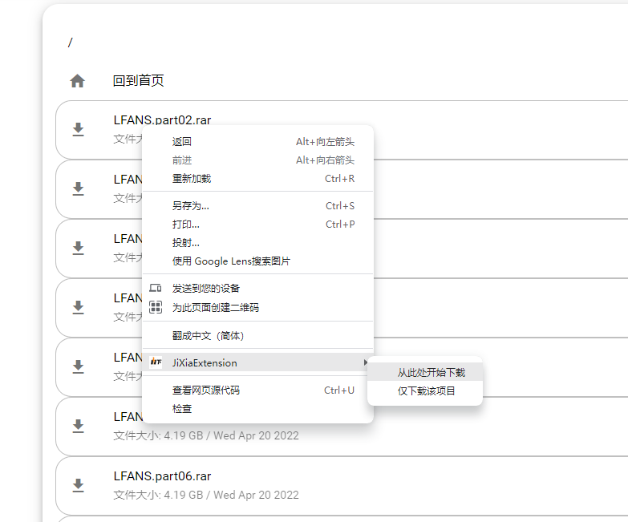

# 极下解析 批量下载 自动下载 chrome插件

## chrome极下批量下载插件，用以自动下载极下解析的百度云列表。

### 安装
打开chrome开发模式，打开扩展窗口，将 jixia_extension.crx 或者整个src文件夹 拖入进扩展页面的窗口即可。  

### 更新
由于chrome对于扩展的限制，可能无法启用扩展。请删除旧的扩展，开启开发者模式，然后将整个 ```src``` 文件夹拖入到扩展页面即可。  

### 下载
**请保证 motrix 已经打开**  
使用极下解析解析列表，然后右击某个项目，选择 "JiXiaExtension" -> "从此处开始下载"  
之后插件将监听下载进度，并自动开始后续项目的下载，直到列表全部下载完成。有一定的纠错、重试机制，但请尽量不要操作页面，避免预期外的行为。  

